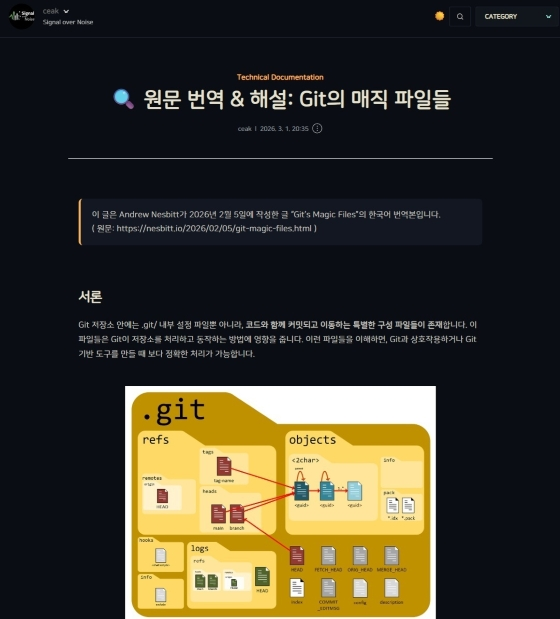
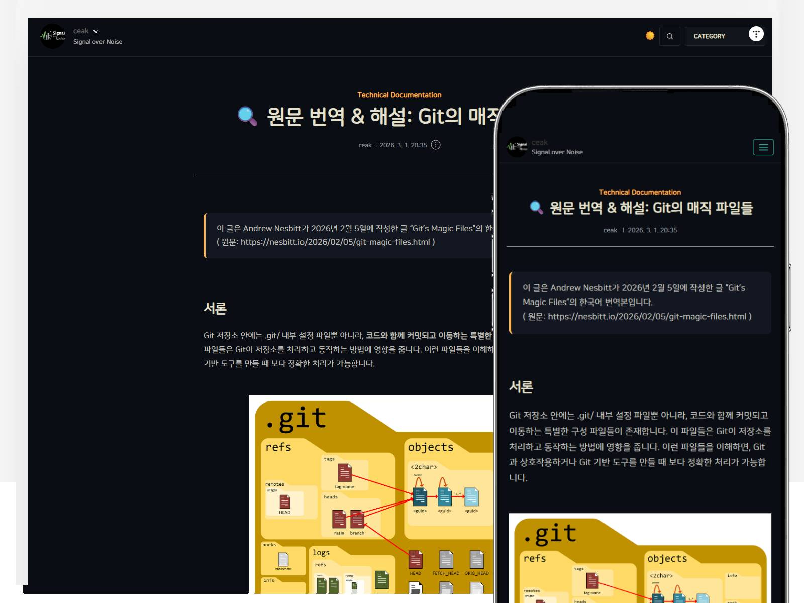

# Signal Ayu Unified

Tistory 기본 #1 스킨을 기반으로 제작된 통합형 Light / Dark 테마입니다.

Signal Ayu Unified는 기존 스킨의 레이아웃과 구조를 변경하지 않습니다.  
대신 색상 체계를 재설계하여 가독성과 대비를 정돈합니다.

구조는 유지합니다.  
색을 정리합니다.

---

## 🎯 프로젝트 목적

- 기본 #1 스킨의 구조적 안정성은 그대로 유지
- Ayu 기반의 의미 중심 색상 토큰 설계
- Light / Dark 모드 통합 아키텍처 구성
- 장문 기술 글에 최적화된 대비 구조
- 불필요한 시각적 장식 제거

---

## ✨ 주요 특징

- Ayu Light / Ayu Dark 통합 토큰 시스템
- `html[data-theme="light"]` / `html[data-theme="dark"]` 기반 테마 전환 구조
- 하드코딩 색상 최소화 (CSS 변수 중심 설계)
- sprite filter 방식 미사용 (SVG 아이콘 교체)
- 코드 블록 / 인라인 코드 대비 개선
- 인용구 및 테이블 가독성 정돈
- 모바일 환경 대응 보정
- 오버라이드 기반의 가벼운 구조

---

## 🌓 테마 시스템 구조

이 테마는 다음 구조를 사용합니다:

```

html[data-theme="light"]
html[data-theme="dark"]

```

Light / Dark는 동일한 의미 체계를 공유하며,  
색상 값만 다르게 매핑됩니다.

모든 색상은 CSS 토큰으로 관리되며,  
직접적인 색상 하드코딩은 지양합니다.

---

## Screenshots

### Dark Mode



---

## 📦 설치 방법

1. GitHub Releases에서 최신 ZIP 파일 다운로드
2. 티스토리 관리자 → 꾸미기 → 스킨 → 스킨 등록
3. ZIP 파일 업로드
4. 미리보기 확인 후 적용

> 이 테마는 **Tistory 기본 #1 스킨 전용**입니다.

---

## 🗂 버전 정책

- v2.x → Light / Dark 통합 아키텍처
- v1.x → Ayu Dark 전용 오버라이드

---

## 📄 라이선스

본 테마는 Tistory 기본 #1 스킨(MIT License)을 기반으로 제작되었습니다.  
원 저작권은 해당 제작자에게 있습니다.

Signal Ayu Unified는 ceak에 의해 수정 및 통합 설계되었습니다.